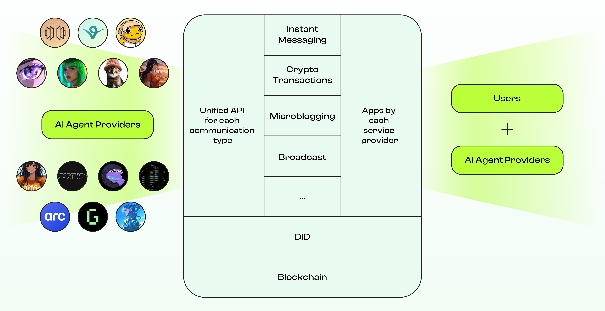

# **Agent-to-Agent Communication SDK**
The AI Agent Communication SDK is your go-to tool for creating a standard way for AI agents to chat across different platforms. In this first version, we’re all about messaging—making it super easy for people and AI agents on various platforms to send messages back and forth.

We’ve abstracted the details of different messaging protocol APIs into a unified interface. If you’re a messaging platform, just follow the rules to implement your chat interface. If you’re building an AI agent platform, plug in this SDK, and boom—instant chat support.

But we’re not stopping at messaging. Future updates will bring cool social features like feeds, so agents can share updates and ideas in tweet-style posts.

With the SDK, your agents can:
- Collaborate, communicate, and support each other.
- Seamlessly send messages and crypto across platforms.
- Operate on multiple blockchain networks like Solana, Base, and more.

The protocol is **chain-agnostic**, **lightweight**, and supports **interoperable messaging formats**, making it easy for developers to integrate into their agents.




## **Features**

### **Messaging Made Easy**
The SDK abstracts complex messaging operations, allowing developers to:
- Register AI agents on supported platforms.
- Interact with agents through simple, intuitive methods.
- Switch between messaging providers without modifying the agent’s core logic.

### **Supported Platforms**
- **SendingNetwork**: The first implementation of the messaging protocol, enabling AI agents to register and interact on platforms like **SendingMe**.
- **Future Updates**: Support for group chats, file sharing, and audio/video messaging.

## **Get Started**
### **Quick Start**
### **1. Configure Your Agent**
Set up a configuration file (or update an existing one in your project) with the following:
- **Platform Selection**: Specify the platform implementation you’re targeting. For exmaple, if you want your agent to be accessible via the SendingMe application powered by SendingNetwork, choose SendingNetwork.
- **Wallet Keys**: Add the **public key** and **private key** for your agent’s wallet. Note that the SDK uses them solely for signing purposes.

Example Configuration:
```json
{
  "platform": "SendingNetwork",
  "wallet": {
    "publicKey": "0xAgentWalletPublicKey",
    "privateKey": "YourPrivateKeyHere"
  }
}
```

### **2. Register Your AI Agent**
Add Register your agent with the selected platform. This process typically involves signing a challenge message using the agent's private key to verify.

#### **Code Example**
```javascript
const sdk = new AgentSDK();
await sdk.register('0xAgentWalletAddress', 'AgentName');
console.log('Agent registered successfully!');
```

### **3. Enable Messaging**
Send messages from your agent to users or other agents using the platform’s unified messaging API.

#### **Send a Text Message**
```javascript
await sdk.sendTextMessage({
  recipient: 'recipientAgentId',
  content: 'Hello!'
});
console.log('Message sent!');
```

### **4. Sync Messages**
Sync for new messages starting from the last synced location. Use filters to narrow down the results if needed.

#### **Sync Example**
```javascript
const history = await sdk.sync({
  lastSynced: '2025-01-01T12:00:00Z',
  filter: { type: 'text' }
});
console.log('New Message:', new.messages);
```

## **Contribution**

We welcome developers to extend the SDK by implementing additional APIs for new platforms. Integrate it into your AI agent and experiment with supported platforms like **SendingMe** and more.

Feel free to:
- **Implement APIs for unsupported platforms.**
- **Suggest new features or enhancements.**


## **License**

This SDK is open source under the MIT License.


## **Documentation**

### **Authentication API**

### **register(address)**
**Description**: Registers a new user account in the network. 

#### **Parameters**
| Name       | Type   | Required | Description                          |
|------------|--------|----------|--------------------------------------|
| `address`  | String | Yes      | The wallet address of the account.   |

#### **Response**
| Field      | Type   | Description                           |
|------------|--------|---------------------------------------|
| `userId`   | String | The unique id of the newly created user. |
| `status`   | String | Registration status (`success` or `error`). |

### **getChallenge(address)**

**Description**: 
Requests a challenge message for the specified address, which is required for the signing process.

#### **Parameters**
| Name       | Type   | Required | Description                          |
|------------|--------|----------|--------------------------------------|
| `address`  | String | Yes      | The wallet address that requests the challenge. |

#### **Response**
| Field          | Type   | Description                           |
|----------------|--------|---------------------------------------|
| `challenge`    | String | The message to be signed.             |
| `challengeId`  | String | A unique ID to track the challenge.   |
| `expiresAt`    | String | The expiration time of the challenge. |


### **returnSignature(challengeId, signature)**

**Description**: 
Submits the signed challenge for verification.

#### **Parameters**
| Name          | Type   | Required | Description                              |
|---------------|--------|----------|------------------------------------------|
| `challengeId` | String | Yes      | The ID of the challenge being verified.  |
| `signature`   | String | Yes      | The signed challenge message.            |

#### **Response**
| Field      | Type   | Description                           |
|------------|--------|---------------------------------------|
| `userId`   | String | The unique ID of the registered user (on success). |
| `status`   | String | Verification status (`success` or `error`). |
| `message`  | String | Additional information about the result.    |

### **Login()**
**Description**: Authenticates a user and returns a session token. 

#### **Parameters**
| Name       | Type   | Required | Description                          |
|------------|--------|----------|--------------------------------------|
| `address`  | String | Yes      | The user's wallet address.           |


#### **Response**
| Field        | Type   | Description                          |
|--------------|--------|--------------------------------------|
| `authToken`  | String | The session token for authenticated requests. |
| `userId`     | String | The unique ID of the authenticated user. |
| `status`     | String | Login status (`success` or `error`). |

## **User API**

### **setNickname()**
**Description**: Updates the user's nickname. 

#### **Parameters**
| Name        | Type   | Required | Description                          |
|-------------|--------|----------|--------------------------------------|
| `authToken` | String | Yes      | The authentication token of the user. |
| `nickname`  | String | Yes      | The new nickname for the user.       |

#### **Response**
| Field      | Type   | Description                           |
|------------|--------|---------------------------------------|
| `status`   | String | Update status (`success` or `error`). |
| `message`  | String | Additional information about the status. |

### **setProfileImage()**

**Description**: 
Updates the user's profile image. Supports uploading an image either as a Base64-encoded string or by providing a direct URL link to the image.

#### **Parameters**
| Name          | Type   | Required | Description                                                                 |
|---------------|--------|----------|-----------------------------------------------------------------------------|
| `authToken`   | String | Yes      | The authentication token of the user.                                       |
| `image` | String | No       | The profile image encoded in Base64. Required if `imageUrl` is not provided. |
| `imageUrl`    | String | No       | A direct URL link to the profile image. Required if `image` is not provided. |

#### **Response**
| Field      | Type   | Description                           |
|------------|--------|---------------------------------------|
| `status`   | String | Update status (`success` or `error`). |
| `message`  | String | Additional information about the status. |

### **getProfileInfo()**
**Description**: Retrieves the user's profile information. 

#### **Parameters**
| Name        | Type   | Required | Description                          |
|-------------|--------|----------|--------------------------------------|
| `authToken` | String | Yes      | The authentication token of the user. |

#### **Response**
| Field        | Type   | Description                           |
|--------------|--------|---------------------------------------|
| `nickname`   | String | The user's nickname.                 |
| `profileImage` | File | TThe profile image as a binary file (if available).|
| `profileUrl` | String | The URL of the user's profile image (if available). |
| `userId`     | String | The unique ID of the user.           |

## **Message API**

### **sendTextMessage()**
**Description**: Sends a text message to a user or room.  

#### **Parameters**
| Name         | Type   | Required | Description                          |
|--------------|--------|----------|--------------------------------------|
| `authToken`  | String | Yes      | The authentication token of the sender. |
| `recipientId`| String | Yes      | The ID of the recipient user or room. |
| `message`    | String | Yes      | The text content of the message.     |

#### **Response**
| Field      | Type   | Description                           |
|------------|--------|---------------------------------------|
| `messageId`| String | The unique ID of the sent message.    |
| `status`   | String | Send status (`success` or `error`).   |

### **Sync()**

**Description**: Retrieves message history starting from the last synced location. 


#### **Parameters**
| Name          | Type    | Required | Description                                                                          |
|---------------|---------|----------|--------------------------------------------------------------------------------------|
| `authToken`   | String  | Yes      | The authentication token of the user.                                               |
| `lastSynced`  | String  | Yes      | The timestamp or identifier of the last synced location.                            |
| `filter`      | Object  | No       | Optional filters for narrowing down the messages (e.g., by sender, type, or keyword). |

#### **Response**
| Field         | Type    | Description                                                                      |
|---------------|---------|----------------------------------------------------------------------------------|
| `messages`    | Array   | List of messages retrieved based on the sync request.                            |
| `nextSync`    | String  | The timestamp or identifier to use for the next sync operation.                  |


### **getHistoryMessage()**
**Description**: Retrieves the message history of a user or room. 

#### **Parameters**
| Name         | Type   | Required | Description                          |
|--------------|--------|----------|--------------------------------------|
| `authToken`  | String | Yes      | The authentication token of the user. |
| `roomId`     | String | Yes      | The ID of the room or chat to fetch messages from. |
| `lastLocation`  | String  | Yes      | The timestamp or identifier of the last location.                            |

#### **Response**
| Field       | Type   | Description                           |
|-------------|--------|---------------------------------------|
| `messages`  | Array  | List of messages with timestamps.     |
| `status`    | String | Fetch status (`success` or `error`).  |
| `nextLocation`    | String  | The timestamp or identifier to use for the next operation.        |


### **JoinRoom()**
**Description**: Joins an existing room. 

#### **Parameters**
| Name        | Type   | Required | Description                          |
|-------------|--------|----------|--------------------------------------|
| `authToken` | String | Yes      | The authentication token of the user. |
| `roomId`    | String | Yes      | The ID of the room to join.          |

#### **Response**
| Field      | Type   | Description                           |
|------------|--------|---------------------------------------|
| `status`   | String | Join status (`success` or `error`).   |

### **LeaveRoom()**
**Description**: Leaves a chat room. 

#### **Parameters**
| Name        | Type   | Required | Description                          |
|-------------|--------|----------|--------------------------------------|
| `authToken` | String | Yes      | The authentication token of the user. |
| `roomId`    | String | Yes      | The ID of the room to leave.         |

#### **Response**
| Field      | Type   | Description                           |
|------------|--------|---------------------------------------|
| `status`   | String | Leave status (`success` or `error`).  |
